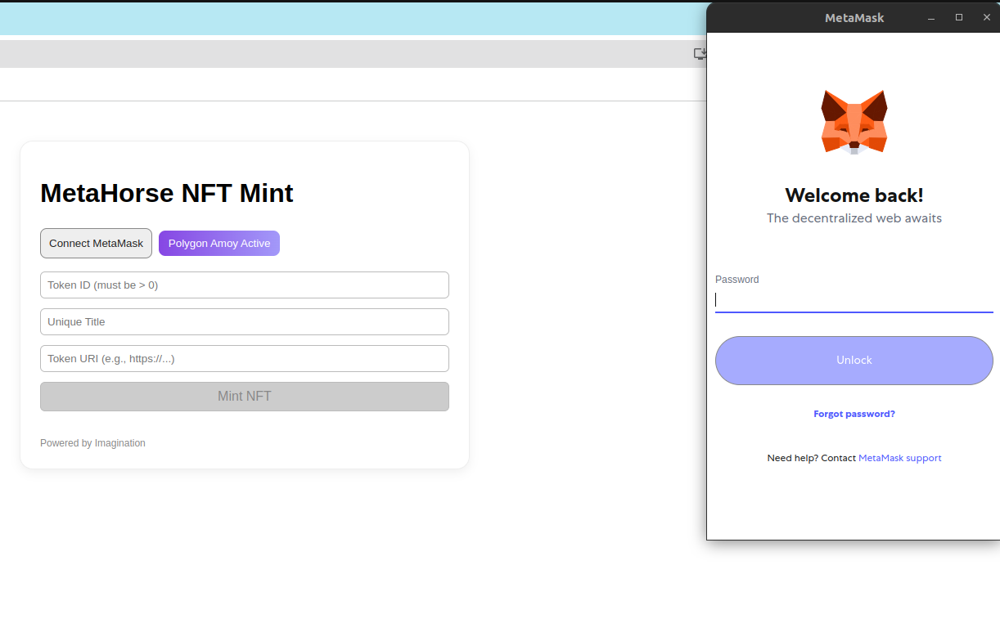
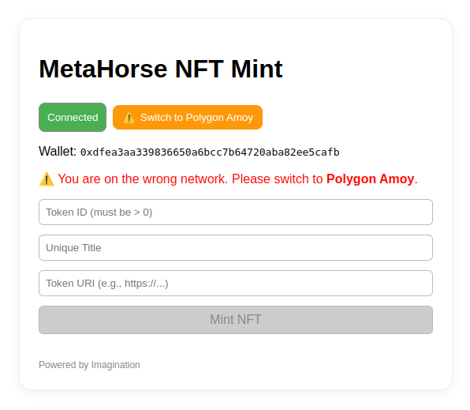
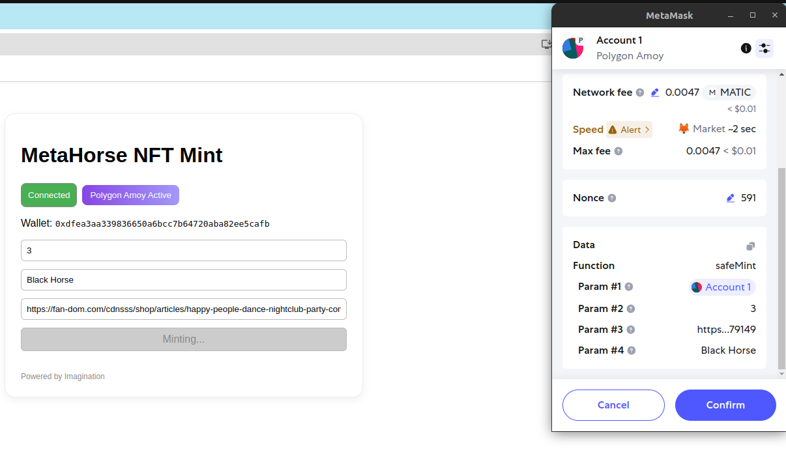
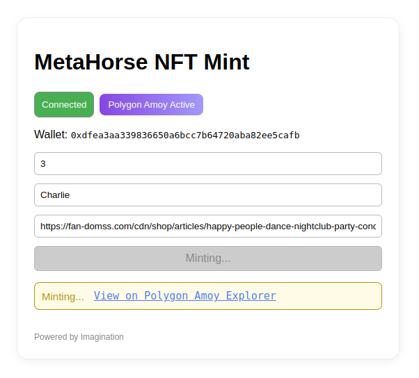
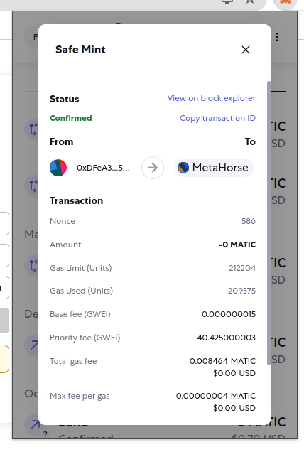

# MetaHorse NFT — Technical Assessment

## Overview

This project is a complete demo DApp for minting NFTs, built for the MetaHorse assessment.
It demonstrates a clean, React-based frontend with **MetaMask integration**, a form for custom NFT minting, and robust error/user feedback.
Smart contract interactions use **ethers.js**, and the contract is deployed on the **Polygon Amoy testnet**.

---

## Features

* **Connect MetaMask:**
  Users connect their MetaMask wallet with a single click.
  Their Ethereum address is shown on the UI.

* **Polygon Amoy Network Switch:**
  The app detects the user’s network. If not on Polygon Amoy, a warning and one-click network switch are provided.

* **NFT Minting Form:**
  Users can mint new NFTs by providing a unique alphanumeric title and a URI.
  Live validation ensures all input rules are followed, with instant error feedback.

* **Mint Status & Explorer Link:**
  After minting, a status and link to view the transaction on the [Polygon Amoy block explorer](https://www.oklink.com/amoy/tx/0x9236150d77eb9d639dcb3895f0081dbaa70852fca907196b6da780e821220aab) is shown.

* **Full Error Handling:**
  All major edge cases and errors are captured with friendly user messages and disabled buttons when appropriate.

---

## Screenshots

### **1. Connect MetaMask**

> The user can connect MetaMask with a single click.
> *See:*
> 

---

### **2. Switch to Polygon Amoy**

> If the user is on the wrong network, a warning appears and the “Switch to Polygon Amoy” button is highlighted in orange.
> *See:*
> 

---

### **3. Live Validation & Form Submission**

> The mint form validates entries in real-time—if a title is invalid or fields are empty, the "Mint NFT" button remains disabled and live error messages are shown under the input. The regex is checked in the form and not in the smart contract to optimize gas fees.
>
> 

---

### **4. Minting and Transaction Status**

> While minting, the button shows “Minting…” and is disabled. After submission, the user is provided with a transaction hash and a direct link to the Polygon Amoy explorer.
>
> 

> On success, the transaction status and link are shown in green:
>
> 

---

## Demo Transaction

**Example successful mint transaction:**
[https://www.oklink.com/amoy/tx/0x9236150d77eb9d639dcb3895f0081dbaa70852fca907196b6da780e821220aab](https://www.oklink.com/amoy/tx/0x9236150d77eb9d639dcb3895f0081dbaa70852fca907196b6da780e821220aab)

---

## Local Setup

### 1. **Install Dependencies**

```bash
git clone https://github.com/YOUR-REPO/metahorse-nft.git
cd metahorse-nft
npm install
```

### 2. **Run the App**

```bash
npm start
```

App runs at `http://localhost:3000`

---

## Smart Contract

* **Network:** Polygon Amoy (ChainId: 80002)
* **Address:** `0x8e94942b0a789aca327261445d846062c23a6eab`
* **ABI:** Included in `MetaHorseNFT.json`

**Features:**

* ERC721 NFT (OpenZeppelin base)
* Only unique, alphanumeric titles (min 3 chars, no leading/trailing spaces)
* URI storage
* Public mint (any user)

---

## Code Quality & UX Highlights

* **React functional components and hooks**
* **All critical states are derived and clearly managed**
* **Live error handling and real-time feedback**
* **UI disables Mint button unless all requirements are met (wallet, network, form validity)**
* **Clear transaction feedback, only shows link and status at the bottom (see images above)**
* **Polygon Amoy network enforced**

---

## Error Handling

* Users cannot mint unless all form fields are valid.
* Network and connection errors are shown immediately.
* Duplicate title or invalid tokenId are rejected with user-friendly messages.
* All error cases are tested and visually indicated.

---

## How to Test

1. Open the app and connect MetaMask.
2. Switch to Polygon Amoy testnet if not already on it.
3. Enter a unique title (alphanumeric, 3+ chars), a valid Token ID (>0), and a URI.
4. Click “Mint NFT”.
5. Confirm the transaction in MetaMask.
6. View transaction progress and results directly in the app and on Polygon Amoy explorer.

---

## Assessment Coverage

* **Connect to MetaMask:** ✔️
* **Mint NFT functionality:** ✔️
* **Success/error handling & messages:** ✔️
* **Clean code, modern UX, and complete error handling:** ✔️
* **Bonus:** Live validation & fully disabled buttons unless all requirements are met.

---

## To Improve

1. **Pre-mint Contract Checks:**
   Currently, the app validates form data (e.g., title format, token ID format) entirely on the frontend. However, before allowing the user to submit a mint transaction (which consumes gas), the app could also **query the smart contract** to check if the chosen title is already used or if the token ID exists.
   This would provide instant feedback, save users from unnecessary gas costs, and further improve UX.
   Of course, this doesn’t eliminate all possible race conditions—two users could submit at the same time—but for true race avoidance, patterns like commit/reveal (e.g., using hashed values or auction-style protocols) would be needed for privacy and fairness.

2. **Known Bugs**
   There is a small UI issue where the "Success" minting message can sometimes be followed or replaced by an error message if the transaction fails or the connection is unstable, making the state unclear. **Always cross-check the final result with the block explorer link provided for the transaction.**