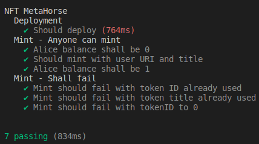

# MetaHorseNFT

MetaHorseNFT is an ERC-721 (NFT) smart contract built with OpenZeppelin contracts, featuring custom logic to restrict NFT titles to one-time use. This project was developed as a technical assessment and includes full test coverage using Hardhat.

Contract Deployed at
- **Testnet:** `Polygon Amoy`
- **Address:** `0x8e94942b0a789aca327261445d846062c23a6eab`
- **ABI:** `./artifacts/contracts/NFT.sol/MetaHorseNFT.json`

## Features

- ERC721 NFTs with URI storage and burnable tokens
- Each NFT requires a unique title; titles can only be used once
- Anyone can mint (no owner restriction)
- Custom error handling for duplicate titles and invalid token IDs

---

## Tech Stack

- Solidity (`^0.8.20`)
- [OpenZeppelin Contracts v5](https://github.com/OpenZeppelin/openzeppelin-contracts)
- Hardhat (development/testing)
---

## Setup & Installation

1. **Clone the repo:**
    ```bash
      git clone https://github.com/yourusername/metahorse-nft.git
      cd metahorse-nft
   ````

2. **Install dependencies:**

   ```bash
   npm install
   ```

3. **Compile contracts:**

   ```bash
   npx hardhat compile
   ```

4. **Run tests:**

   ```bash
   npx hardhat test
   ```

---

## Deployment

Deploy the contract on any EVM-compatible testnet (e.g., Sepolia, Holesky), set your Mnemonic and URL on the hardhat configfuration file:

```bash
npx hardhat run --network polygonAmoy scripts/deploy.js
```

*Update your network config in `hardhat.config.js` as needed.*

---

## Contract Details

* **Contract Name:** `MetaHorseNFT`

* **Symbol:** `METH`

* **Functions:**

  * `safeMint(address to, uint256 tokenId, string uri, string title)`
  * `getName()`, `getSymbol()`, `getOwnerOf(tokenId)`, `getBalances(owner)`

* **Custom Errors:**

  * `TitleAlreadyUsed(title)` — Reverts if the title is already used
  * `tokenIdPositive()` — Reverts if `tokenId` is zero

* **Title-to-ID Mapping:**

  * Each title can only be used once. Attempts to reuse a title will revert.

---

## Testing

The contract includes comprehensive tests in `test/Nft.js`:

* Successful deployment and mint
* Minting with unique title & tokenId
* Fails on duplicate tokenId, duplicate title, or tokenId = 0

*Sample test output:*

